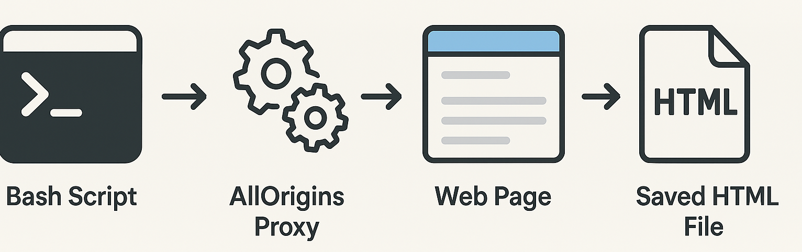

# Page Downloader

A command-line tool that downloads web pages, bypasses CORS restrictions, removes anti-scraping measures, and opens them locally in your browser with all images and resources properly loaded.



## What This Does

This script downloads any web page and makes it viewable locally by:

1. **Downloading via AllOrigins proxy** - Bypasses CORS and firewall restrictions
2. **Parsing JSON response** - Extracts the HTML content from the proxy response
3. **Removing anti-scraping redirects** - Strips base tags and JavaScript redirects that prevent local viewing
4. **Rewriting resource URLs** - Proxies all images, CSS, and other assets through AllOrigins so they load properly
5. **Adding security headers** - Includes Content Security Policy to allow cross-origin resources
6. **Opening in browser** - Automatically opens the processed page in your default browser

The script provides visual progress indicators showing each step and includes a spinner for longer operations.

## Quick Usage

**Remote execution (no installation required):**
```bash
curl -s https://raw.githubusercontent.com/Enelass/page-fetcher/main/download_page.sh | bash -s -- "https://example.com"
```

**Add shell alias for convenience:**
```bash
# Add to ~/.zshrc or ~/.bashrc
alias download_page='curl -s https://raw.githubusercontent.com/Enelass/page-fetcher/main/download_page.sh | bash -s --'

# Then use like:
download_page "https://example.com"
```

## How It Works

```
┌─────────────────┐    ┌──────────────────┐    ┌─────────────────┐
│   Target URL    │───▶│  AllOrigins API  │───▶│  JSON Response  │
│ https://site... │    │ api.allorigins   │    │ {contents: ...} │
└─────────────────┘    │     .win/get     │    └─────────────────┘
                       └──────────────────┘             │
                                                        ▼
┌─────────────────┐    ┌──────────────────┐    ┌─────────────────┐
│  Browser Opens  │◀───│  Process & Save  │◀───│  Extract HTML   │
│   /tmp/page     │    │ Remove redirects │    │ Parse with jq   │
└─────────────────┘    │ Rewrite URLs     │    └─────────────────┘
                       │ Add CSP headers  │
                       └──────────────────┘
```

## Requirements

- **macOS** - Uses the `open` command to launch the browser
- **curl** - For downloading web content (pre-installed on macOS)
- **jq** - For JSON parsing (`brew install jq`)
- **Internet connectivity** - Must be able to reach api.allorigins.win
- **Proxy/SSL support** - If behind corporate firewall, ensure curl can access HTTPS endpoints

## Installation

### Local Installation

```bash
# Download the script
curl -O https://raw.githubusercontent.com/yourusername/page-downloader/main/download_page.sh
chmod +x download_page.sh

# Optional: Install globally
sudo cp download_page.sh /usr/local/bin/download_page
```

### Remote Execution

Run directly without downloading:

```bash
curl -s https://raw.githubusercontent.com/yourusername/page-downloader/main/download_page.sh | bash -s -- "https://example.com"
```

## Usage

### Basic Usage

```bash
./download_page.sh "https://example.com"
```

### Global Installation Usage

```bash
download_page "https://example.com"
```

### Remote Execution

```bash
curl -s https://raw.githubusercontent.com/yourusername/page-downloader/main/download_page.sh | bash -s -- "https://www.reddit.com/r/programming"
```

## How It Works

The script uses the AllOrigins service (https://allorigins.win) as a proxy to bypass CORS restrictions and corporate firewalls. It:

1. Sends the target URL to AllOrigins `/get` endpoint
2. Receives a JSON response containing the page HTML
3. Processes the HTML to remove anti-scraping measures
4. Rewrites all resource URLs (images, CSS, etc.) to use AllOrigins `/raw` endpoint
5. Adds appropriate security headers for cross-origin resource loading
6. Saves the processed file to `/tmp` with a timestamp
7. Opens the file in your default browser

## Output

Files are saved to `/tmp` with the format:
```
/tmp/domain.com_YYYYMMDD_HHMMSS.html
```

The script outputs the full path of the saved file for reference.

## Progress Indicators

The script shows colored progress indicators:
- `[1/4] Downloading page via AllOrigins proxy...` (with spinner)
- `[2/4] Parsing JSON response...`
- `[3/4] Removing anti-scraping redirects...`
- `[4/4] Rewriting resource URLs for proxy...`

## Error Handling

The script includes comprehensive error handling for:
- Missing URL argument
- Network connectivity issues
- Missing jq dependency
- JSON parsing failures
- File system errors

## Security Considerations

**Important Security Notice**: This tool downloads static web page content only and does not execute JavaScript or create persistent network connections. It is not designed to evade network restrictions or bypass security policies.

### Technical Security
- The script uses AllOrigins as a third-party proxy service
- All requests go through api.allorigins.win
- Content Security Policy headers are added to allow cross-origin resources
- No sensitive data is stored or transmitted beyond the target URL
- Downloads are limited to static HTML content - no active code execution
- Files are saved locally to `/tmp` with no network exposure

### Responsible Usage
**User Responsibility**: It is your responsibility to use this tool reasonably and ethically. Do not use this tool to:
- Access malicious or prohibited content
- Bypass corporate security policies or network restrictions
- Download copyrighted material without permission
- Circumvent website terms of service
- Access content that violates local laws or regulations

This tool is intended for legitimate research, development, and educational purposes only. Users must comply with all applicable laws, regulations, and website terms of service when using this tool.

## Limitations

- Requires internet access to AllOrigins service
- Some dynamic content may not render properly
- JavaScript-heavy sites may have limited functionality
- Large pages may take 20-30 seconds to process

## Troubleshooting

**Images not loading initially**: Refresh the browser page once or twice. This is due to browser caching behavior with cross-origin resources.

**jq command not found**: Install jq with `brew install jq`

**Network errors**: Check internet connectivity and ensure AllOrigins service is accessible

**Corporate firewall**: Ensure curl can access HTTPS endpoints and api.allorigins.win is not blocked

## License

MIT License - Feel free to use, modify, and distribute.